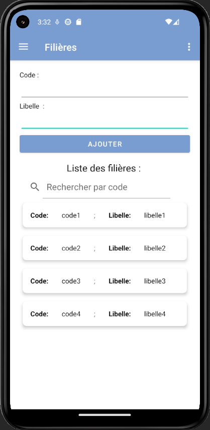

# gestionEtudiants

#### Quelques tests avec Swagger 

### La page de Swagger 

### Test d'API GET de rôles

### Test d'API Post de rôles

## La base de données après ces modifications

### Test d'API Delete de filières

### Test d'API Post d'étudiants

## La base de données apès les modifications

### Première page

### Navigation Drawer

### Page gestion filières 

### Ajout d'une filière 

### Options supprimer et modifier

### Suppression d'une filière

### Modification d'une filière

### Page gestion rôles

# Cette page a les mêmes fonctionnalités d'ajouter, supprimer et modifier que la page de gestion filières

### Page gestion étudiants

# Cette page a les mêmes fonctionnalités d'ajouter, supprimer et modifier que la page de gestion filières

